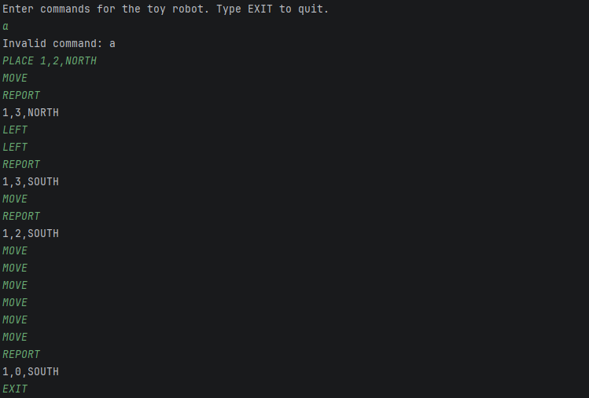

# ToyRobotChallenge Solution

## TODO:

- Confirm debug binding + fresh install to ensure maven build is ide independent
- Confirm all outputs are expected, and add more test cases if needed, then correct the code
- TODO - How to run section

## Original Brief 

- [Link](docs/Brief.md)

## How to run

- Just simple run instructions

## Example Run 

## Description

### Architecture Overview

- Layered design separating input handling, business logic, and domain models

- Clear flow: **CommandParser** → **RobotService** → **Domain objects**

#### Input Layer

**CommandParser**

- Parses raw user input into structured commands

- Delegates execution to the service layer

- Contains no business logic

#### Service Layer

**RobotService**

- Central coordinator of the application

- Executes commands such as Move, TurnLeft, TurnRight

- Validates moves against table boundaries before applying them

- Prevents invalid state changes (e.g. moving off the table)

#### Domain Layer

**Robot**

- Maintains current state (position and direction)

- Implements movement and rotation behavior

**Position**

- Represents the robot’s coordinates on the table

**Direction**

- Represents the robot’s orientation (e.g. North, South, etc.)

**Table**

- Defines the boundaries (width and height)

- Used by the service layer to validate movements

### Execution Flow

- User enters a command

- CommandParser parses it

- RobotService receives and processes it

- RobotService checks constraints using Table

- RobotService manages Robot state changes accordingly

- If valid, Robot updates its state